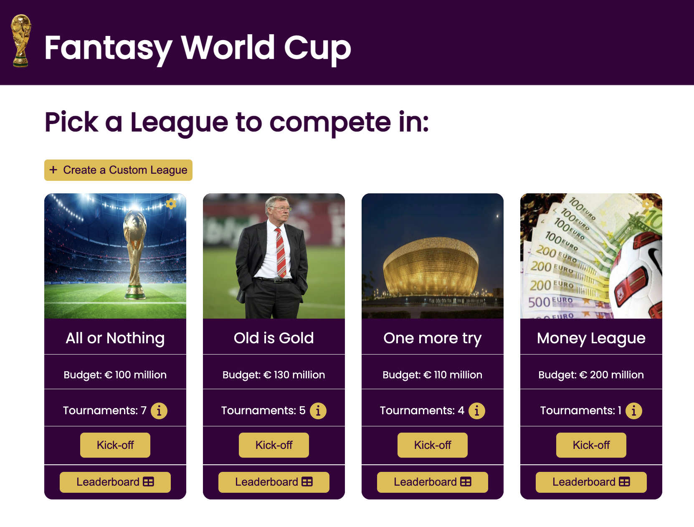
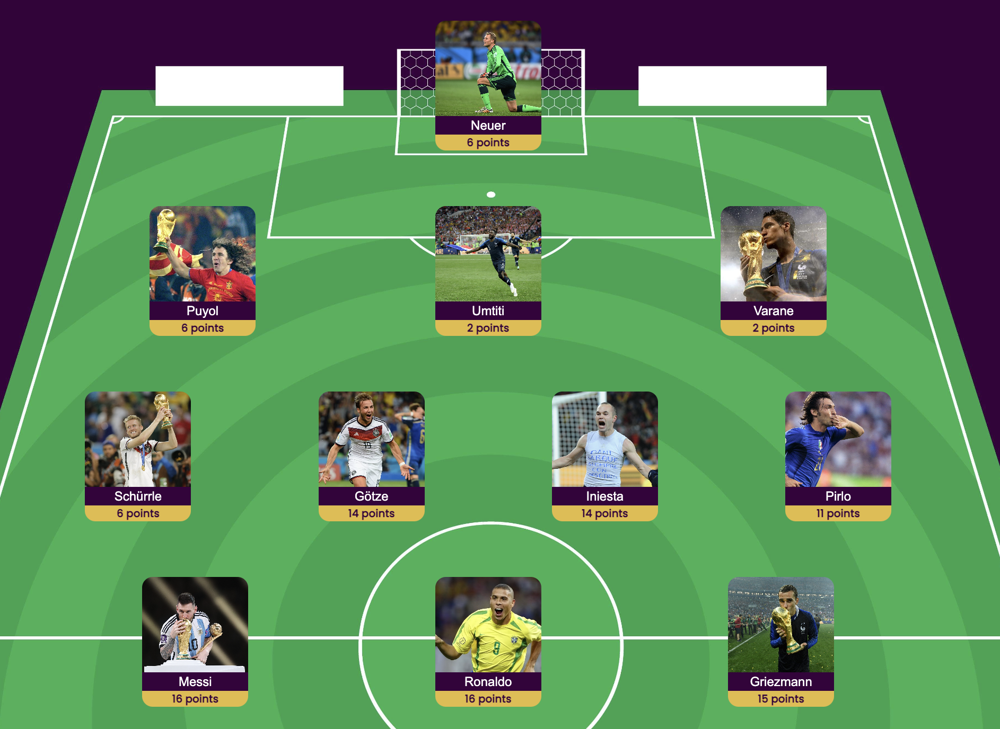
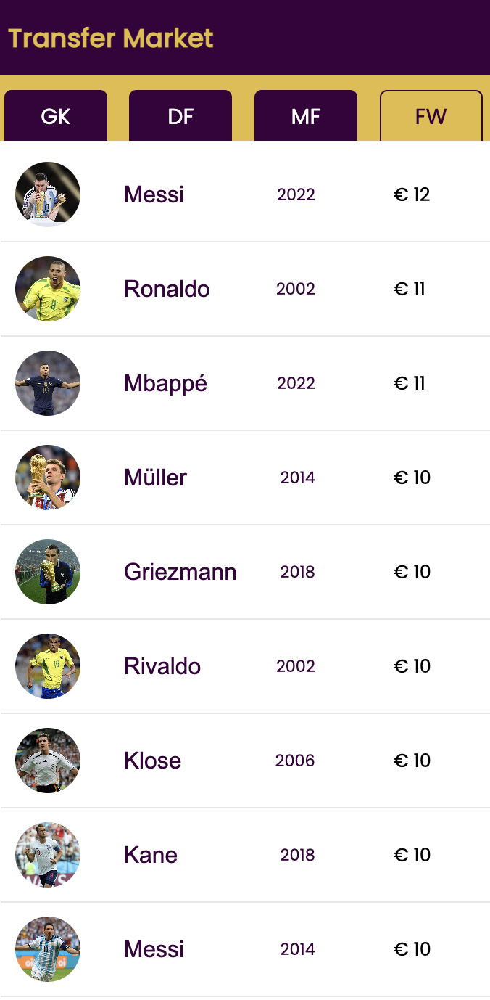
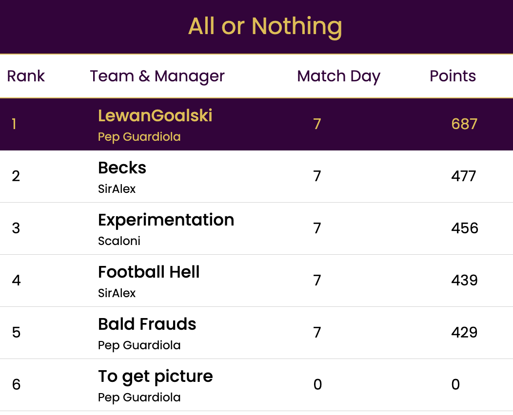

# Fantasy World Cup

## **About**

Fantasy WC is a full-stack web application cloned and inspired by Fantasy Premier League with a twist. The game involves building a tema of past and present world cup heroes to get the highest score and brag to your friends.

[Click to view FantasyWC Live](https://fantasy-world-cup-history.onrender.com)

## 💻 **Tech Stack**

### Languages:

[![JavaScript][javascript-shield]][javascript-url]
[![Python][python-shield]][python-url]
[![HTML][html-shield]][html-url]
[![CSS][css-shield]][css-url]

### Backend Development:

[![Flask][flask-shield]][flask-url]

### Frontend Development:

[![react][react-shield]][react-url]
[![react-router][react-router-shield]][react-router-url]
[![redux][redux-shield]][redux-url]

## ✨ **Features**:


## Leagues

### Users can create and join leagues to compete with friends. Leagues can be customized to allow different team budgets, and set varrying combinations of world cups to choose players from.




## Teams

### Create teams to fill out your fantasy of being a manager during the World Cup. Managers may change team formations and gain points every matchday depending on their starting 11.




## Player Transfers

### Managers can transfer players in and out of their team during the World Cup. Have Toni Kroos 2014 for the 7-1 semi-final thrashing of Brazil, and transfer him out for Iniesta's 2010 goal and man of the match performance in the final. You better not transfer out Messi 2022 though, you'd be shooting yourself in the foot.




## Leaderboards

### Each league comes with a dedicated leaderboard to track which teams and managers performed the best. Scores are updated as new team's join and earn points.




## 📁 Installation
1. Clone this repository (only this branch)

2. Install dependencies

      ```bash
      pipenv install -r requirements.txt
      ```

3. Create a **.env** file based on the example with proper settings for your
   development environment

4. Make sure the SQLite3 database connection URL is in the **.env** file

5. This starter organizes all tables inside the `flask_schema` schema, defined
   by the `SCHEMA` environment variable.  Replace the value for
   `SCHEMA` with a unique name, **making sure you use the snake_case
   convention**.

6. Get into your pipenv, migrate your database, seed your database, and run your Flask app

   ```bash
   pipenv shell
   ```

   ```bash
   flask db upgrade
   ```

   ```bash
   flask seed all
   ```

   ```bash
   flask run
   ```

7. To run the React App in development, checkout the [README](./react-app/README.md) inside the `react-app` directory.

<!-- MARKDOWN LINKS & IMAGES -->

[javascript-shield]: https://img.shields.io/badge/JavaScript-323330?style=for-the-badge&logo=javascript&logoColor=F7DF1E
[python-shield]: https://img.shields.io/badge/Python-3776AB?style=for-the-badge&logo=python&logoColor=white
[html-shield]: https://img.shields.io/badge/HTML5-E34F26?style=for-the-badge&logo=html5&logoColor=white
[css-shield]: https://img.shields.io/badge/CSS-239120?&style=for-the-badge&logo=css3&logoColor=white
[flask-shield]: https://img.shields.io/badge/Flask-000000?style=for-the-badge&logo=flask&logoColor=white
[sqlite-shield]: https://img.shields.io/badge/SQLite-07405E?style=for-the-badge&logo=sqlite&logoColor=white
[postgresql-shield]: https://img.shields.io/badge/PostgreSQL-316192?style=for-the-badge&logo=postgresql&logoColor=white
[react-shield]: https://img.shields.io/badge/React-20232A?style=for-the-badge&logo=react&logoColor=61DAFB
[react-router-shield]: https://img.shields.io/badge/React_Router-CA4245?style=for-the-badge&logo=react-router&logoColor=white
[redux-shield]: https://img.shields.io/badge/Redux-593D88?style=for-the-badge&logo=redux&logoColor=white
[linkedin-shield]: https://img.shields.io/badge/LinkedIn-0077B5?style=for-the-badge&logo=linkedin&logoColor=white
[javascript-url]: https://www.javascript.com/
[python-url]: https://www.python.org/
[html-url]: https://www.w3.org/html/
[css-url]: https://www.w3.org/Style/CSS/Overview.en.html
[flask-url]: https://flask.palletsprojects.com/en/2.2.x/
[sqlite-url]: https://www.sqlite.org/index.html
[postgresql-url]: https://www.postgresql.org/
[react-url]: https://reactjs.org/
[react-router-url]: https://reactrouter.com/en/main
[redux-url]: https://redux.js.org/
